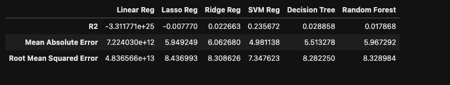
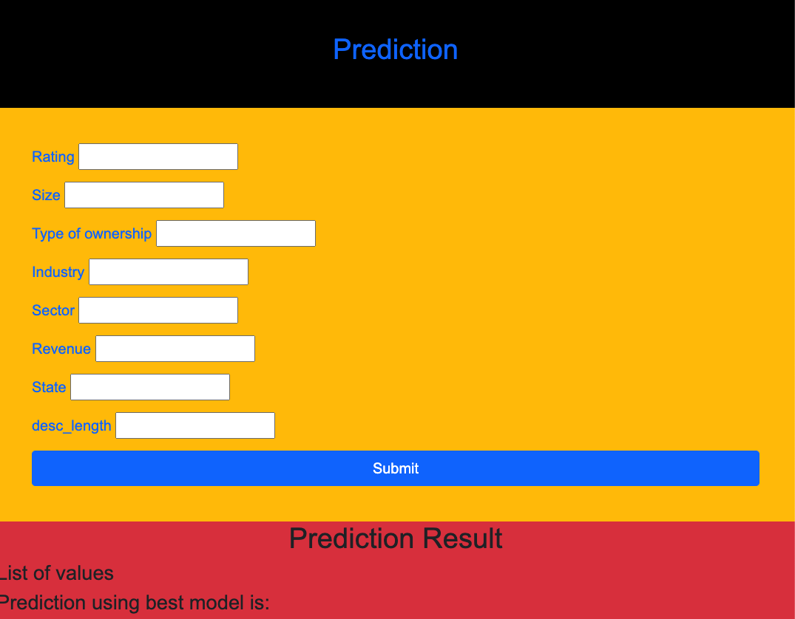

# postdoc_salary_proj: Project Overview
## Background
Created a tool that estimates postdoc salaries to help them to negotiate their income when they get a job. Data is obtained by scraping over 400 job descriptions from glassdoor using python and selenium. Data is cleaned by using pandas and different linear model from scikitlearn like Linear, Lasso, and Random Forest Regressors were used to get the best model.Also built a website using flask, html, bootstrap.
  
  ## Code and Resources Used
  Packages: pandas, numpy, sklearn, matplotlib, seaborn, selenium, flask, json
  For Web Framework Requirements: pip install -r requirements.txt
  
  Scraper Github: https://github.com/arapfaik/scraping-glassdoor-selenium
  
  Scraper Article: https://towardsdatascience.com/selenium-tutorial-scraping-glassdoor-com-in-10-minutes-3d0915c6d905
  

## Web Scraping
Scraped 400 jobs postings from glassdoor.com. 

## Data Cleaning
After scraping the data, data is cleaned using pandas.Some of data cleaning steps are:
* Getting min and max salary only from salary estimate column
* Making new column average salary
* Making state column
* Creating new column with job description length

## Model Building
Only the revelent columns were choosen and split in training and testing set using traintest split. Since ifferent columns have differnt scale so standrazied training and testing data using standardscaler.

Different linear models were used:
   * **Linear Regression** – Baseline for the model
   * **Lasso Regression** 
   * **Ridge Regression** 
   * **Support vector machine** 
    * **Decision Tree**
   * **Random Forest** 
   
## Scores of each columns (Random Forest)

## Model performance
The Random Forest model far outperformed the other approaches on the test and validation sets. A screen shot of differnt evaluation metrices is as:

##  Random and predicted values using different models on test set

## Productionization
Created a intrecative webpage using HTML, CSS, javascript,and Bootstrap and with Flask templating to create a new HTML page that displays all of the information. The API endpoint takes in a request with a list of values from a job listing and returns an estimated salary.

